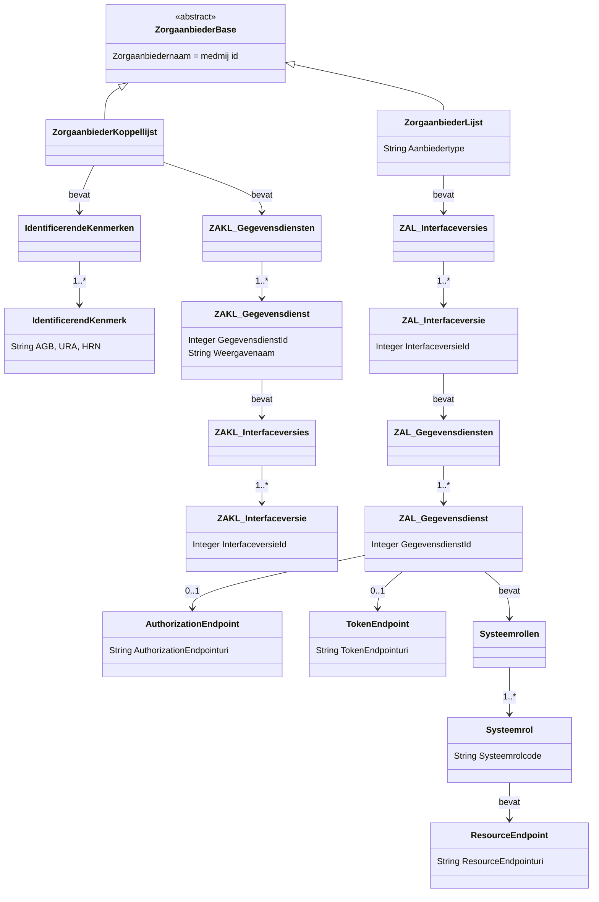

# Importing MedMij Lists

There are two types of MedMij List:

- ZAL ("ZorgAanbiederLijst", meaning healthcare provider list)
- ZKL ("ZorgaanbiederKoppelLijst", meaning healthcare provider relation list)

To import ZALs or ZKLs into the system, first obtain them from MedMij, then use the `organisation:import` cron command.

```shell
    python -m app.cron organisation:import <xml-file>
```

The import script will determine the type of MedMij List based on the XML and process it accordingly.
 Each MedMij List has a reference and timestamp which is used to mark the import,
 in order for the system to be able to retrieve the latest version of the imported data.

## Structure of the MedMij Lists and the correlation between ZAL and ZKL

In short, the ZAL provides actual addresses of the endpoints for a healthcare provider,
 while the ZKL provides the mapping between the healthcare provider and its identifying characteristics
 (like AGB code, URA code, HRN code), so that an contact information addressing system like zorgab can be used to display healthcare provider contact data, while the actual endpoints are retrieved from the ZAL.


